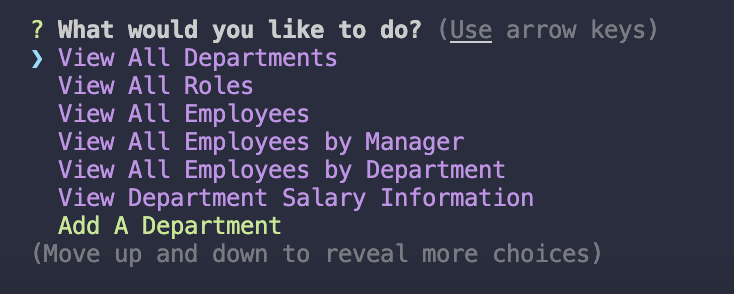
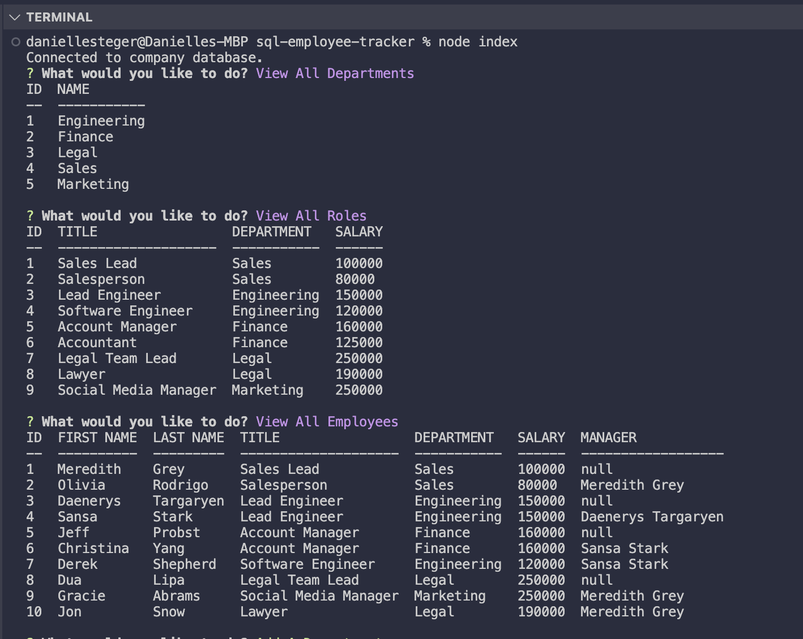
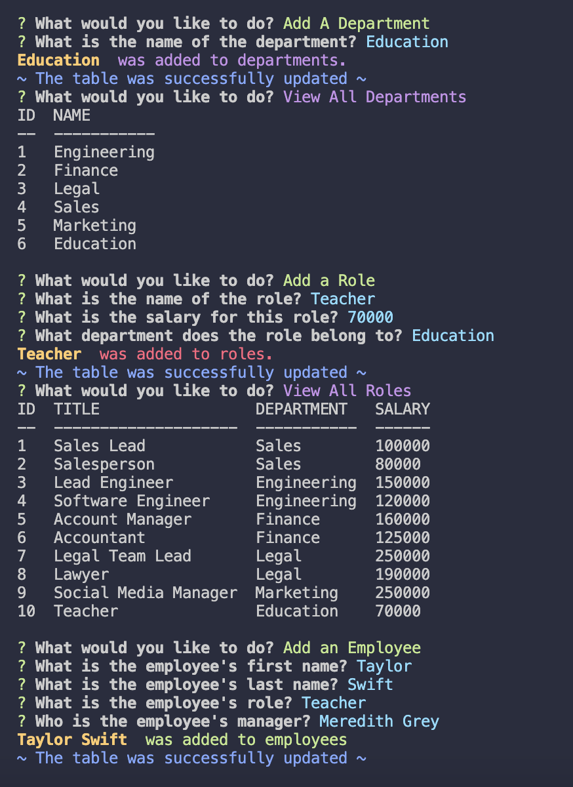
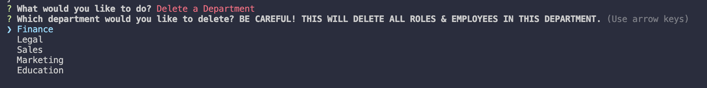
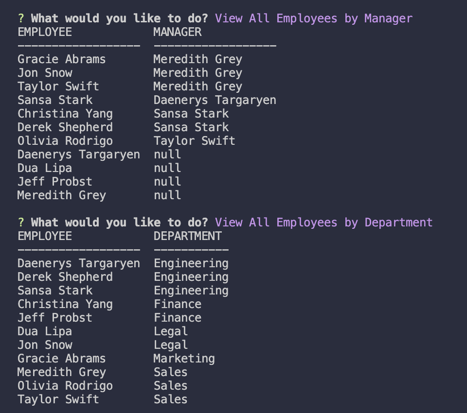
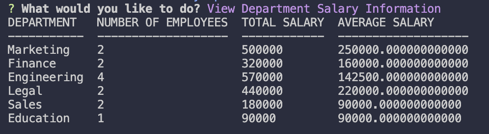

# SQL Employee Tracker

[](https://opensource.org/licenses/MIT)

## Description

This project involved creating a command-line application connected with a SQL database to input, store, modify, and view employee data. It was created using JavaScript, SQL, Express, Node, Inquirer, colors, console.table and PostgreSQL.

---

---

## Table of Contents

- [Installation](#installation)
- [Usage](#usage)
- [Credits](#credits)
- [License](#license)

---

---

## Installation

### Clone this repository

```
git clone git@github.com:danimsteger/svg-employee-tracker.git
```

### Go into this repository

```
cd svg-employee-tracker
```

### Access code of the repository

```
code .
```

### Install Necessary Dependencies on local device

```
npm install
```

---

---

## Usage

To view a video walkthrough of this application, click [here](https://drive.google.com/file/d/1r6mD8iPLumYyfLTntgI6QW7Ca7gprsKV/view?usp=sharing).

To view the program, navigate to the cloned repository. To setup the data base, run the following commands:

### Navigate to PostgreSQL as user 'postgres':

Input your password for postgres if necessary.

```
psql -U postgres
```

### Setup Database and Tables:

```
\i db/schema.sql
```

### Seed Database with Data or input your own:

```
\i db/seeds.sql
```

Once the database has been created and seeded, users can run the application. Enter the following command in your terminal to invoke the application:

### Start Application:

```
node index
```

Once the application has been started, users will be prompted with a list of options to chose from to interact with the database.



Users can use their 'UP' and 'DOWN' arrow keys on their keyboard to navigate through the options and view them all.

'View All Departments', 'View All Roles', and 'View all Employees' options will display clean tables of the given information sorted by ID.


'Add a Department', 'Add a Role', and 'Add an Employee' options allow a user to add in information to the database. Users can navigate to other options to view their additions.



Additionally, users can update a given employee's role or manager.


Messages are displayed as all modifications are made to inform users of their success. In addition to the above basic features, users can also delete a department, role, or employee through the 'Delete a Department,' 'Delete a Role', and 'Delete an Employee' options.



Users should not that if a department is deleted, all roles and employees that were previously associated with that department will also be deleted. If a role is deleted, all employees that were assigned that role will also be deleted. If an employee is deleted and they were the manager of another employee, that employee will now have a default 'null' manager. However, users can use the 'Update an Employee's Manager' feature shown above to add a new manager.

In addition to these delete features, users also have additional information that they can view. Users can view a list of employees sorted by manager or sorted by department via the 'View All Employees by Manager' and 'View All Employees by Department' options.



Finally, users can view important information about the company by department. By selecting 'View Department Salary Information' users are presented with a table that lists the departments, the number of employees in each department, the total sum of all the salaries of that department and the average salary of that department.



---

---

## Credits

This project was created entirely by Danielle Steger. To complete this project, several articles on "MDN Web Docs" and "W3Schools" were referenced. Several specific articles are linked below. Additionally, materials by edX Boot Camps LLC were referenced, adopted, and modified. This project was comleted with the use of node, SQL, and several npm modules including Inquirer@8.2.4, colors, console.table and PostgreSQL and their corresponding documentation was referenced as well.

- To display tables in the command-line, npm console.table method was used and can be found [here](https://www.npmjs.com/package/console.table).

- To join multiple tables together, the I referenced an article linked [here](https://learnsql.com/blog/how-to-join-3-tables-or-more-in-sql/).

- To link the manager_id column to the employee_id column(another column within the same table), I referenced an article linked [here](https://www.w3schools.com/sql/sql_join_self.asp).

- To make a manager id be null if an employee's manager was deleted, I referenced an article linked [here](https://www.w3schools.com/sql/func_sqlserver_coalesce.asp).
